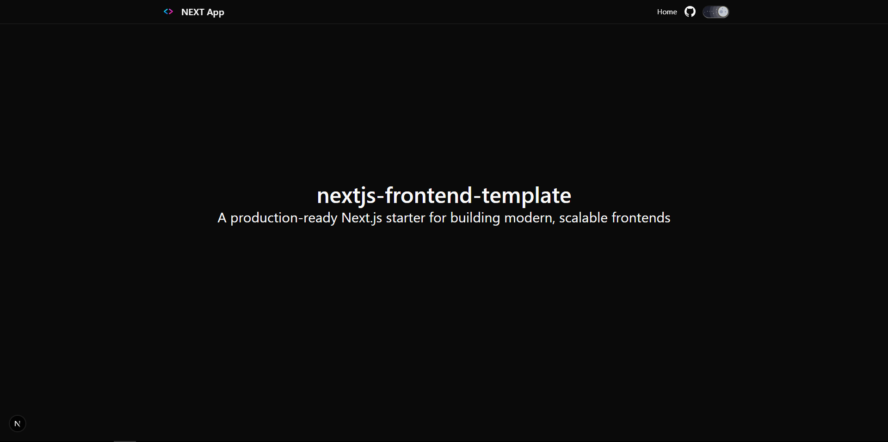

# Next.js Frontend Template



Hi there! 👋 Welcome to your new favorite starting point for Next.js projects.

This isn't just another boilerplate—it's a carefully crafted, production-ready template designed to let you hit the ground running. Whether you're building a SaaS product, a portfolio, or a complex web application, this starter kit handles the boring setup so you can focus on building what matters.

Built with the bleeding-edge tech stack you actually want to use: **Next.js 16**, **React 19**, **Tailwind CSS 4**, and **Shadcn UI**.

## ✨ Why this template?

We've all been there—spending hours configuring ESLint, setting up dark mode, or fighting with Tailwind configs before writing a single line of feature code. This template solves that. It comes pre-configured with best practices, type safety, and a beautiful UI library, so you can start shipping features on Day 1.

### 🚀 Features at a Glance

- **Next.js 16 (App Router)**: The latest and greatest from Vercel, optimized for performance.
- **React 19**: Ready for the future of React.
- **Tailwind CSS 4**: The newest, fastest version of the utility-first framework.
- **Shadcn UI**: Beautiful, accessible components that you can actually customize.
- **Dark Mode Ready**: Built-in theme switching with `next-themes`.
- **Type-Safe**: 100% TypeScript for fewer bugs and better autocomplete.
- **Linting & Formatting**: ESLint and Prettier are already set up to keep your code clean.

## 🛠️ Tech Stack

- **Framework**: [Next.js](https://nextjs.org/)
- **UI Library**: [React](https://react.dev/)
- **Styling**: [Tailwind CSS](https://tailwindcss.com/)
- **Components**: [Shadcn UI](https://ui.shadcn.com/)
- **Icons**: [Lucide React](https://lucide.dev/)
- **Package Manager**: npm or Bun

## ⚡ Quick Start

Getting started is super easy — you start the dev server manually from your terminal.

You can use either `npm` or `Bun`.

### 1. Clone the repo

```bash
git clone https://github.com/piyushsarkar-dev/nextjs-frontend-template.git
cd nextjs-frontend-template
```

### 2. Install dependencies

Pick your fighter:

**Using npm:**

```bash
npm install
```

**Using Bun (Recommended for speed):**

```bash
bun install
```

### 3. Run the development server

**npm:**

```bash
npm run dev
```

**Bun:**

```bash
bun dev
```

Open [http://localhost:3000](http://localhost:3000) in your browser, and you're live! 🚀

### Other useful commands

```bash
npm run lint
npm run build
npm run start
npm run prod
```

## 🔧 Customization

Make it yours! Below is a step-by-step guide to customizing `package.json`.

### Step-by-step: Customize `package.json`

1. Update project identity
   - `name`: set to your app/package name (example: `my-app`).
   - `version`: set an initial version (example: `0.1.0`).
   - `private`: keep `true` for apps (prevents accidental publishing).
   - `author`, `license`, `homepage`: set these to your own values.

2. Choose your package manager (recommended: pick one)
   - This repo currently supports `npm` and `bun` (there is both a `package-lock.json` and `bun.lock`).
   - If you only want one, remove the lockfile you won’t use so installs stay consistent.
   - Keep `engines` in sync with what you’ll actually run in CI and locally.

3. Understand and customize scripts
   - `dev`: starts Next.js in development mode.
   - `build`: creates a production build.
   - `start`: runs the production server (requires `build` first).
   - `lint`: runs ESLint.
   - `prod`: runs `eslint && next build && next start`.

   Common additions you can add safely:
   - `typecheck`: `tsc --noEmit`
   - `format`: `prettier --write .`
   - `format:check`: `prettier --check .`

4. Add or remove dependencies (the right way)
   - Runtime packages go in `dependencies`.
   - Tooling packages go in `devDependencies`.
   - Examples:
     - `npm install <pkg>` / `npm install -D <pkg>`
     - `bun add <pkg>` / `bun add -d <pkg>`

5. Add environment variables
   - Create `.env.local` (not committed by default) for local secrets.
   - In Next.js, variables prefixed with `NEXT_PUBLIC_` are exposed to the browser.

## 📂 Project Structure

Here's how we've organized things to keep it clean and scalable:

```
├── public/              # Static assets (images, fonts, etc.)
├── src/
│   ├── app/             # Main application routes (App Router)
│   ├── components/      # Your UI building blocks
│   │   ├── Header/      # Navigation components
│   │   ├── Providers/   # App-wide providers (Theme, Context)
│   │   └── shadcnui/    # The beautiful Shadcn components
│   ├── hooks/           # Custom React hooks
│   └── lib/             # Utility functions (cn, etc.)
├── next.config.ts       # Next.js configuration
└── package.json         # Dependencies and scripts
```

## 📜 Scripts

- `dev`: Spin up the dev server.
- `build`: Compile for production.
- `start`: Run the production build locally.
- `lint`: Check your code for style issues.
- `prod`: Lint, build, and start (one command).

## 👤 Author

**Piyush Sarkar**

- GitHub: [@piyushsarkar-dev](https://github.com/piyushsarkar-dev)

---

_Happy Coding!_ 💻
